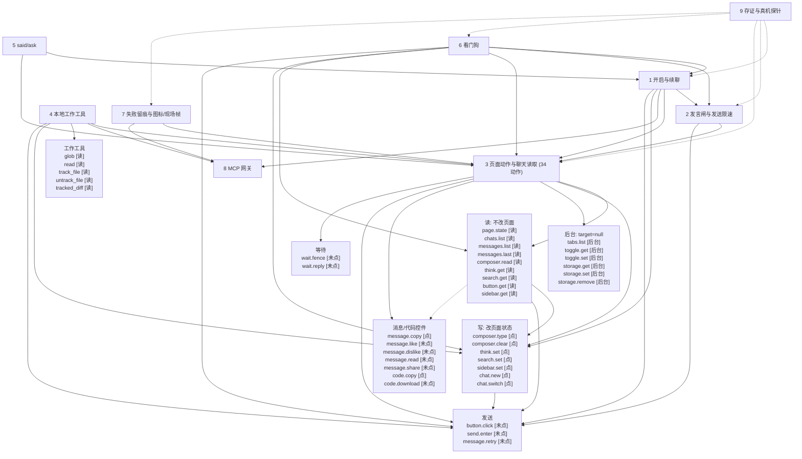

<!-- wayfinder:graph:start -->

```mermaid
flowchart TB
  D1["1 开启与续聊"]
  D2["2 发言闸与发送限速"]
  D3["3 页面动作与聊天读取 (34 动作)"]
  D4["4 本地工作工具"]
  D5["5 said/ask"]
  D6["6 看门狗"]
  D7["7 失败留痕与图标/现场帧"]
  D8["8 MCP 网关"]
  D9["9 存证与真机探针"]
  A_READ["读: 不改页面<br/>page.state [读]<br/>chats.list [读]<br/>messages.list [读]<br/>messages.last [读]<br/>composer.read [读]<br/>think.get [读]<br/>search.get [读]<br/>button.get [读]<br/>sidebar.get [读]"]
  A_WRITE["写: 改页面状态<br/>composer.type [点]<br/>composer.clear [点]<br/>think.set [点]<br/>search.set [点]<br/>sidebar.set [点]<br/>chat.new [点]<br/>chat.switch [点]"]
  A_BG["后台: target=null<br/>tabs.list [后台]<br/>toggle.get [后台]<br/>toggle.set [后台]<br/>storage.get [后台]<br/>storage.set [后台]<br/>storage.remove [后台]"]
  A_MSG["消息/代码控件<br/>message.copy [点]<br/>message.like [未点]<br/>message.dislike [未点]<br/>message.read [未点]<br/>message.share [未点]<br/>code.copy [点]<br/>code.download [未点]"]
  A_SEND["发送<br/>button.click [未点]<br/>send.enter [未点]<br/>message.retry [未点]"]
  A_WAIT["等待<br/>wait.fence [未点]<br/>wait.reply [未点]"]
  D4_G_WORK["工作工具<br/>glob [读]<br/>read [读]<br/>track_file [读]<br/>untrack_file [读]<br/>tracked_diff [读]"]

  D2 --> D3
  D1 --> D2
  D1 --> D3
  D1 --> D8
  D4 --> D3
  D4 --> D8
  D5 --> D1
  D5 --> D3
  D6 --> D1
  D6 --> D2
  D6 --> D3
  D7 --> D3
  D7 --> D8
  D9 -.-> D1
  D9 -.-> D2
  D9 -.-> D3
  D9 -.-> D6
  D9 -.-> D7
  D3 --> A_READ
  D3 --> A_WRITE
  D3 --> A_BG
  D3 --> A_MSG
  D3 --> A_SEND
  D3 --> A_WAIT
  D4 --> D4_G_WORK
  D1 --> A_WRITE
  D1 --> A_SEND
  D4 --> A_WRITE
  D4 --> A_SEND
  D6 --> A_READ
  D6 --> A_WRITE
  D6 --> A_SEND
  D2 --> A_SEND
  A_READ --> A_WRITE
  A_READ --> A_SEND
  A_READ -.-> A_MSG
  A_WRITE --> A_SEND
```

<!-- wayfinder:graph:end -->
